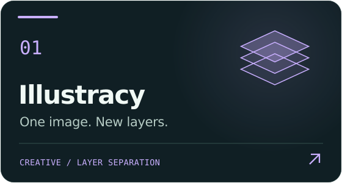
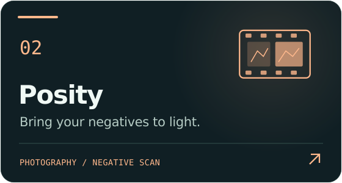
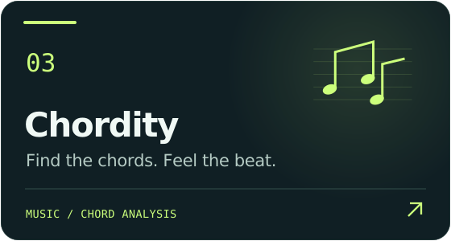
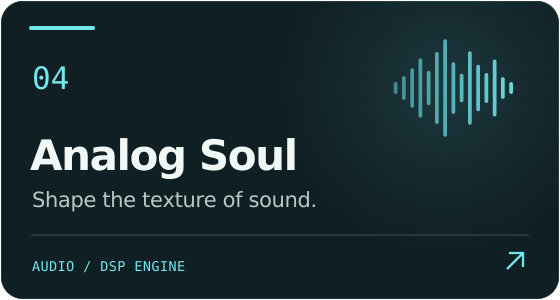
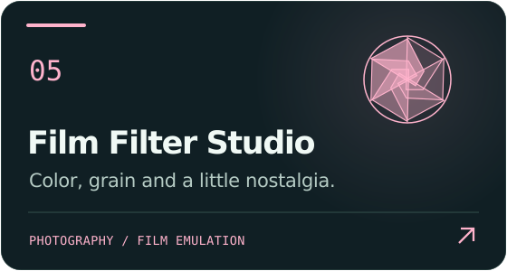
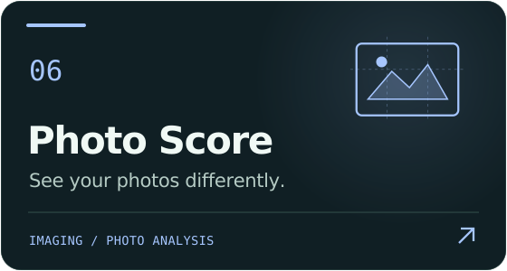

  

<h1 align="center">안녕하세요, 연이입니다.</h1>

  <strong>쓸 것보다, 쓰임받을 것을 개발합니다.</strong> 
  소리와 사진, 창작의 원리를 누구나 사용하기 쉬운 도구로 옮깁니다.

  <a href="#projects">프로젝트</a> ·
  <a href="#approach">만드는 방식</a> ·
  <a href="https://github.com/Velvitty?tab=repositories">모든 저장소</a>

  

## 아이디어가 도구가 되는 곳

카드를 누르면 각 프로젝트의 소스와 자세한 설명을 볼 수 있습니다.

  
  

  
  

  
  

<strong>어떤 도구인지 한눈에 보기</strong>

| 프로젝트 | 할 수 있는 일 |
| --- | --- |
| [Illustracy](https://github.com/Velvitty/Illustracy) | 일러스트를 분석해 편집 가능한 레이어와 PSD로 재구성합니다. |
| [Posity](https://github.com/Velvitty/Scanner) | 컬러 네거티브 스캔을 사진으로 변환하고 색과 밝기를 조절합니다. |
| [Chordity](https://github.com/Velvitty/Chordity) | 음원의 코드와 박을 추정하고, 메트로놈과 합성 피아노로 확인합니다. |
| [Analog Soul](https://github.com/Velvitty/efx) | 아날로그 질감과 공간 효과를 조절하고 WAV로 내보냅니다. |
| [Film Filter Studio](https://github.com/Velvitty/Film_Sim) | 필름 색감·그레인·할레이션과 빈티지 렌즈 효과를 적용합니다. |
| [Photo Score](https://github.com/Velvitty/Photo_Scorer) | 사진의 수치적 특징을 분석하고 촬영·후보정 팁을 제공합니다. |

레이어 분리와 코드 인식은 원본을 분석해 얻는 추정 결과이며, 사진 점수는 수치와 규칙에 기반한 참고 지표입니다. 사용 방법과 각 도구의 한계는 프로젝트 문서에서 확인할 수 있습니다.

## 복잡한 원리에서, 쉬운 사용까지

**쓰임을 먼저 생각합니다.** 당연하게 여겨 온 불편함에 질문하고, 실제 사용하는 사람의 목소리에서 출발합니다.

**근거를 바탕으로 만듭니다.** 가정과 검증된 사실을 구분하고, 결과뿐 아니라 그 결과가 나오는 원리와 한계도 설명합니다.

**작은 필요에도 가치를 둡니다.** 소수의 필요에도 쓸모가 있다고 믿으며, 복잡한 기술을 누구나 쉽게 사용할 수 있게 다듬습니다.

**브라우저를 작업 공간으로 삼습니다.** 주로 HTML에 JavaScript와 CSS를 담아, 클라이언트에서 실행되는 도구를 개발합니다.

<strong>더 둘러보기</strong>

- [MacGuard](https://github.com/Velvitty/MacGuard) — 브라우저 안에서 잠금 화면과 이벤트 경보를 제공하는 도구입니다.
- [전체 저장소](https://github.com/Velvitty?tab=repositories)

 

  

