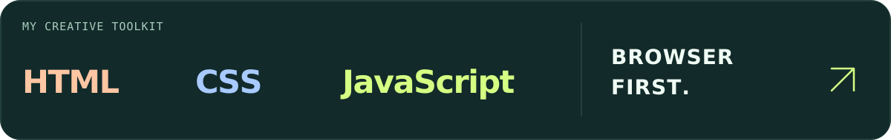
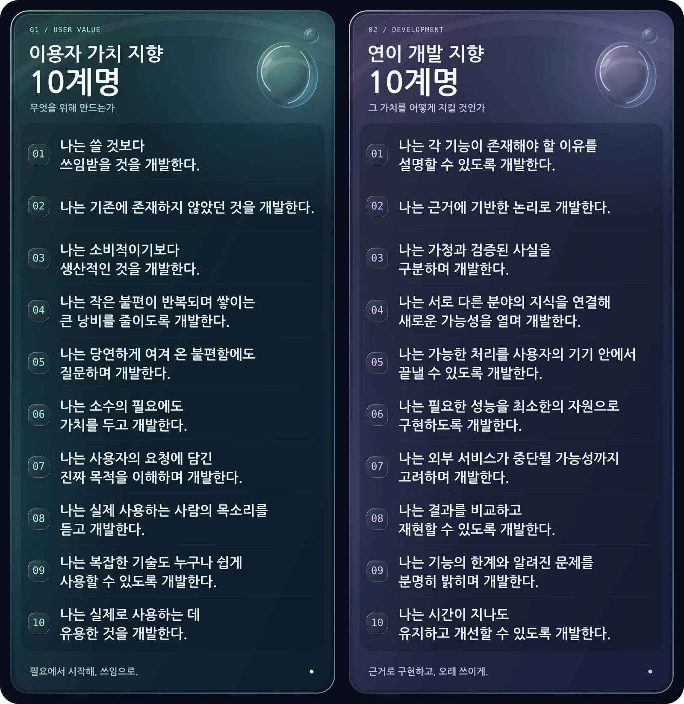
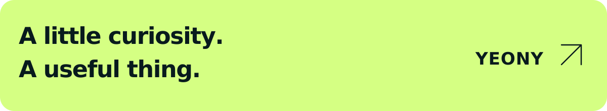

<picture><source media="(max-width: 640px)" srcset="assets/studio/hero-mobius-xyz-mobile.svg" /></picture>

<h1 align="center">쓸 것보다, 쓰임받을 것을.</h1>

  안녕하세요, <strong>연이(Yeony)</strong>입니다. 
  소리와 사진, 창작의 원리를 누구나 사용하기 쉬운 도구로 옮깁니다.

  <strong>기기는 달라도, 쓰임은 같도록.</strong> 
  크로스 플랫폼 · 성능 최적화 · 반응형 설계

  <a href="#projects"><strong>프로젝트 탐색 ↘</strong></a>　·　
  <a href="#approach">만드는 방식</a>　·　
  <a href="#principles">개발 철학</a>　·　
  <a href="https://github.com/Velvitty?tab=repositories">모든 저장소 ↗</a>

<picture><source media="(max-width: 640px)" srcset="assets/studio/stack-mobile.svg" /></picture>

## 아이디어가 도구가 되는 곳

사진의 색을 다시 찾고, 소리의 구조를 읽고, 창작의 다음 단계를 열어 주는 도구들입니다. **카드를 누르면 프로젝트로 이동합니다.**

  <a href="https://github.com/Velvitty/Illustracy"><picture><source media="(max-width: 640px)" srcset="assets/studio/illustracy-layers-compact.svg" /></picture></a>
  <a href="https://github.com/Velvitty/Scanner"><picture><source media="(max-width: 640px)" srcset="assets/studio/posity-compact.svg" /></picture></a>

  <a href="https://github.com/Velvitty/Chordity"><picture><source media="(max-width: 640px)" srcset="assets/studio/chordity-1200ms-compact.svg" /></picture></a>
  <a href="https://github.com/Velvitty/efx"><picture><source media="(max-width: 640px)" srcset="assets/studio/analog-soul-compact.svg" /></picture></a>

  <a href="https://github.com/Velvitty/Film_Sim"><picture><source media="(max-width: 640px)" srcset="assets/studio/film-studio-compact.svg" /></picture></a>
  <a href="https://github.com/Velvitty/Photo_Scorer"><picture><source media="(max-width: 640px)" srcset="assets/studio/photo-score-live-compact.svg" /></picture></a>

<strong>프로젝트별 기능을 자세히 보기</strong>

| 프로젝트 | 할 수 있는 일 |
| --- | --- |
| [Illustracy](https://github.com/Velvitty/Illustracy) | 일러스트를 분석해 편집 가능한 레이어와 PSD로 재구성합니다. |
| [Posity](https://github.com/Velvitty/Scanner) | 컬러 네거티브 스캔을 사진으로 변환하고 색과 밝기를 조절합니다. |
| [Chordity](https://github.com/Velvitty/Chordity) | 음원의 코드와 박을 추정하고, 메트로놈과 합성 피아노로 확인합니다. |
| [Analog Soul](https://github.com/Velvitty/efx) | 아날로그 질감과 공간 효과를 조절하고 WAV로 내보냅니다. |
| [Film Filter Studio](https://github.com/Velvitty/Film_Sim) | 필름 색감·그레인·할레이션과 빈티지 렌즈 효과를 적용합니다. |
| [Photo Score](https://github.com/Velvitty/Photo_Scorer) | 사진의 수치적 특징을 분석하고 촬영·후보정 팁을 제공합니다. |

레이어 분리와 코드 인식은 원본을 분석해 얻는 추정 결과이며, 사진 점수는 수치와 규칙에 기반한 참고 지표입니다. 사용 방법과 각 도구의 한계는 프로젝트 문서에서 확인할 수 있습니다.

## 복잡한 원리에서, 쉬운 사용까지

**쓰임을 먼저 생각합니다.** 당연하게 여겨 온 불편함에 질문하고, 실제 사용하는 사람의 목소리에서 출발합니다.

**근거를 바탕으로 만듭니다.** 가정과 검증된 사실을 구분하고, 결과뿐 아니라 그 결과가 나오는 원리와 한계도 설명합니다.

**작은 필요에도 가치를 둡니다.** 소수의 필요에도 쓸모가 있다고 믿으며, 복잡한 기술을 누구나 쉽게 사용할 수 있게 다듬습니다.

**기기의 경계를 넘습니다.** 운영체제에 묶이지 않도록 웹으로 만들고, 최적화와 반응형 설계를 기본으로 삼습니다.

## 쓰임을 위한 두 가지 10계명

**개발의 가치는, 누군가의 다음 행동을 가능하게 하는 데 있다고 생각합니다.**

필요를 잘못 짚으면 정교한 기능도 쓰일 자리를 찾기 어렵고, 필요한 기능도 느리거나 쉽게 멈추면 쓰임이 이어지기 어렵습니다. 그래서 **무엇을 위해 만들지**는 「이용자 가치 지향 10계명」으로, **그 가치를 어떻게 지킬지**는 「연이 개발 지향 10계명」으로 정리했습니다. 기능을 더하거나 방향을 바꿀 때마다 돌아보고 싶은 판단 기준입니다.

<!-- principles-glass-start -->

  <picture><source media="(max-width: 640px)" srcset="assets/studio/principles-glass-readable-mobile.svg" /></picture>

<!-- principles-glass-end -->

<strong>이용자 가치 지향 10계명 · 무엇을 위해 만드는가</strong>

사람의 필요에서 출발해, 실제로 도움이 되는 결과에 닿기 위한 기준입니다.

#### 01. 나는 쓸 것보다 쓰임받을 것을 개발한다.

**이유와 근거** — 만드는 사람에게 익숙한 방식이 처음 사용하는 사람에게도 자연스럽다고 단정할 수는 없습니다. 제게 편리하다는 이유만으로는 다른 사람의 작업에도 도움이 되는지 알기 어렵습니다.

**선택과 기대** — 누가, 어떤 상황에서, 무엇을 끝내기 위해 이 도구를 찾을지부터 묻고자 합니다. 처음 여는 순간부터 결과를 가져가는 순간까지 그 사람의 흐름을 살피면, 필요할 때 다시 찾는 도구에 가까워질 수 있다고 생각합니다.

#### 02. 나는 기존에 존재하지 않았던 것을 개발한다.

**이유와 근거** — 이미 있는 도구들 사이에도 해결되지 않은 작업이나 끊어진 흐름이 있을 수 있습니다. 새로운 도구를 만들 이유는 그 빈틈에서 찾을 수 있다고 생각합니다.

**선택과 기대** — 흩어진 절차를 하나로 잇거나, 다른 분야의 방법을 가져와 이전에는 어려웠던 작업을 가능하게 하고자 합니다. 이용자가 할 수 있는 일이 실제로 늘어날 때, 새로움에도 분명한 쓰임이 생길 것입니다.

#### 03. 나는 소비적이기보다 생산적인 것을 개발한다.

**이유와 근거** — 이용자가 들인 시간과 집중이 결과물이나 배운 방법으로 남으면 다음 작업에도 이어질 수 있습니다. 한 번의 사용이 다음 시도의 발판이 되는 도구를 만들고 싶습니다.

**선택과 기대** — 직접 만들고, 고치고, 비교하고, 결과를 저장해 다시 활용할 수 있는 흐름을 중시합니다. 사용을 마친 뒤 손에 남는 것이 있다면, 이용자가 스스로 할 수 있는 일도 조금씩 넓어질 것이라 기대합니다.

#### 04. 나는 작은 불편이 반복되며 쌓이는 큰 낭비를 줄이도록 개발한다.

**이유와 근거** — 파일을 옮기거나 같은 값을 다시 입력하는 일은 한 번에는 사소해 보여도 반복될수록 시간과 주의를 요구합니다. 불편의 크기를 판단할 때는 한 번의 수고와 반복되는 횟수를 함께 봐야 한다고 생각합니다.

**선택과 기대** — 자주 되풀이하는 절차를 찾아 묶고, 이미 제공한 정보를 다시 요구하는 지점을 줄이고자 합니다. 준비와 정리에 쓰이는 수고를 덜면, 이용자가 판단과 창작에 집중할 여지도 커질 것입니다.

#### 05. 나는 당연하게 여겨 온 불편함에도 질문하며 개발한다.

**이유와 근거** — 오래 사용해 온 방식에는 꼭 필요한 절차와 과거의 제약 때문에 남은 절차가 섞여 있을 수 있습니다. 익숙해졌다는 사실만으로 지금도 필요한지는 알 수 없습니다.

**선택과 기대** — “왜 이 단계를 거쳐야 할까?”를 묻고, 그 이유가 현재 환경에서도 유효한지 살피고자 합니다. 제약이 달라진 지점을 찾으면, 사용법을 더 쉽게 설명하는 데서 나아가 절차 자체를 줄일 가능성도 열립니다.

#### 06. 나는 소수의 필요에도 가치를 두고 개발한다.

**이유와 근거** — 이용자의 수와 한 사람이 겪는 불편의 깊이는 서로 다른 기준입니다. 필요로 하는 사람이 적어도 대체할 방법이 마땅치 않다면 작은 도구 하나가 작업의 가능 여부를 바꿀 수 있습니다.

**선택과 기대** — 필요의 구체성, 불편의 정도, 다른 해결 방법의 유무를 함께 살피고자 합니다. 그동안 선택지가 부족했던 사람에게 실제로 쓸 수 있는 방법을 더하는 데에도 개발의 가치가 있다고 믿습니다.

#### 07. 나는 사용자의 요청에 담긴 진짜 목적을 이해하며 개발한다.

**이유와 근거** — “버튼을 추가해 주세요”라는 요청에는 단계를 줄이고 싶거나 결과를 더 잘 확인하고 싶다는 목적이 담겨 있을 수 있습니다. 제안된 기능만 보면 그 기능이 해결해야 할 문제를 놓치기 쉽습니다.

**선택과 기대** — 요청이 나온 상황과 원하는 결과를 먼저 이해하고, 그 목적에 맞는 해결 방법을 찾고자 합니다. 목적을 분명히 알수록 필요한 기능을 정확히 고르고, 이용자의 수고를 더 직접적으로 줄일 수 있을 것입니다.

#### 08. 나는 실제 사용하는 사람의 목소리를 듣고 개발한다.

**이유와 근거** — 개발하면서 예상한 사용 흐름과 실제 환경에서의 흐름은 다를 수 있습니다. 이용자가 어디에서 멈추고 무엇을 이해하기 어려워하는지는 실제 사용 과정에서 확인해야 합니다.

**선택과 기대** — 의견의 배경과 막힌 지점을 듣고, 수정한 뒤에도 같은 문제가 남는지 확인하고자 합니다. 이 과정을 반복하면 제 예상과 실제 쓰임 사이의 차이를 줄이고, 개선의 우선순위도 더 분명히 정할 수 있을 것입니다.

#### 09. 나는 복잡한 기술도 누구나 쉽게 사용할 수 있도록 개발한다.

**이유와 근거** — 기능에 도달하기 전에 어려운 용어와 설정을 익혀야 한다면, 기술이 줄 수 있는 도움도 그 문턱을 넘은 사람에게만 닿게 됩니다. 사용자가 이해해야 할 내용과 도구가 대신 처리할 내용을 나눌 필요가 있습니다.

**선택과 기대** — 목적이 드러나는 말, 상황에 맞는 기본값, 결과를 확인할 수 있는 피드백을 우선하고자 합니다. 세밀한 조절은 필요할 때 접근할 수 있게 두어, 처음 사용하는 사람도 시작하고 익숙해진 사람도 더 깊이 활용할 수 있기를 바랍니다.

#### 10. 나는 실제로 사용하는 데 유용한 것을 개발한다.

**이유와 근거** — 기능의 유용함은 실제 작업을 얼마나 수월하게 끝내게 하는지에서 확인할 수 있습니다. 입력이 번거롭거나 결과를 이해하고 가져가기 어렵다면 도구의 도움은 그 지점에서 줄어듭니다.

**선택과 기대** — 시작부터 결과의 활용까지 살피며 정확성, 이해하기 쉬운 정도, 필요한 수고를 점검하고자 합니다. 이용자가 자신의 다음 작업으로 자연스럽게 이어 갈 수 있다면, 개발의 출발점이었던 ‘쓰임’도 실제 결과로 확인할 수 있을 것입니다.

<strong>연이 개발 지향 10계명 · 그 가치를 어떻게 지킬 것인가</strong>

필요한 기능이 다양한 환경에서 신뢰할 수 있게 동작하고, 시간이 지나도 개선될 수 있도록 지키고 싶은 기준입니다.

#### 01. 나는 각 기능이 존재해야 할 이유를 설명할 수 있도록 개발한다.

**이유와 근거** — 기능을 하나 더하면 구현뿐 아니라 사용자가 이해할 내용과 앞으로 관리할 범위도 늘어납니다. 무엇을 돕는지 불분명한 기능은 그만큼의 복잡함을 감수할 이유도 설명하기 어렵습니다.

**선택과 기대** — 각 기능이 해결할 문제와 필요한 상황, 잘 작동한다고 판단할 기준을 분명히 하고자 합니다. 존재 이유를 설명할 수 있으면 추가와 수정의 우선순위를 정하고, 도구의 목적을 일관되게 유지하기도 수월해질 것입니다.

#### 02. 나는 근거에 기반한 논리로 개발한다.

**이유와 근거** — 익숙한 방법이나 그럴듯한 결과만으로 선택하면 어떤 조건에서 잘 작동하는지 설명하기 어렵습니다. 동작 원리와 관찰한 결과를 함께 살펴야 선택의 타당성을 점검할 수 있습니다.

**선택과 기대** — 해결하려는 문제, 선택한 방법, 확인한 결과가 이어지도록 설명하고자 합니다. 판단의 근거가 드러나면 잘못된 선택을 수정하고, 다음 개선을 어디에서 시작할지도 더 정확히 정할 수 있을 것입니다.

#### 03. 나는 가정과 검증된 사실을 구분하며 개발한다.

**이유와 근거** — 확인하지 않은 전제를 사실처럼 다루면 이후 판단도 같은 불확실성을 안게 됩니다. 특히 분석과 추정의 결과는 어떤 조건에서 어느 정도 확인했는지가 중요합니다.

**선택과 기대** — 알고 있는 것, 추정하는 것, 아직 확인해야 할 것을 나누고 검증한 범위를 밝혀 두고자 합니다. 이렇게 구분하면 이용자는 결과를 해석할 기준을 얻고, 개발자는 다음에 확인할 문제를 더 선명하게 볼 수 있을 것입니다.

#### 04. 나는 서로 다른 분야의 지식을 연결해 새로운 가능성을 열며 개발한다.

**이유와 근거** — 분야가 달라도 변화를 측정하고, 패턴을 찾고, 결과를 조절하는 문제는 닮아 있을 수 있습니다. 한 분야에서 익힌 방법이 다른 분야의 막힌 지점을 풀 실마리가 될 수 있다고 생각합니다.

**선택과 기대** — 사진·음향·인터페이스에서 얻은 지식을 연결하되, 옮겨 온 방법이 새로운 조건에서도 타당한지 확인하고자 합니다. 이런 연결을 통해 따로 존재하던 기능들이 하나의 작업 흐름으로 이어지고, 새로운 창작 방식도 열릴 수 있기를 기대합니다.

#### 05. 나는 가능한 처리를 사용자의 기기 안에서 끝낼 수 있도록 개발한다.

**이유와 근거** — 파일을 외부로 보내야 하는 처리에는 전송 시간과 네트워크 의존성이 더해집니다. 기기 안에서 끝낼 수 있는 작업이라면 원본을 전송하지 않는 흐름을 설계할 여지가 생깁니다.

**선택과 기대** — 작업의 크기와 기기의 성능을 고려해 가능한 처리를 기기 안에서 마치고, 파일이 어디에서 처리되는지도 분명히 하고자 합니다. 불필요한 전송을 줄이고 이용자가 자신의 작업과 데이터를 더 직접적으로 다룰 수 있기를 기대합니다.

#### 06. 나는 필요한 성능을 최소한의 자원으로 구현하도록 개발한다.

**이유와 근거** — 기기마다 처리 능력과 메모리, 화면 크기가 다르므로 자원을 많이 요구하는 설계는 사용할 수 있는 환경을 좁힐 수 있습니다. 여러 기기에서 사용할 수 있게 하려면 접근 경로와 실제 동작의 부담을 함께 살펴야 합니다.

**선택과 기대** — 운영체제의 경계를 낮추기 위해 웹으로 만들고, **반응형 설계를 기본으로 삼으며 성능을 최대한 최적화합니다.** 필요한 품질과 응답성을 기준으로 불필요한 연산과 메모리 사용을 줄여, 작은 화면과 성능이 제한된 기기에서도 쓰임이 이어지도록 하고자 합니다.

#### 07. 나는 외부 서비스가 중단될 가능성까지 고려하며 개발한다.

**이유와 근거** — 외부 서비스의 가용성이나 제공 방식은 제가 통제할 수 있는 범위를 벗어납니다. 하나의 의존성이 멈췄을 때 작업 전체가 영향을 받는 구조라면, 이용자의 흐름도 함께 끊길 수 있습니다.

**선택과 기대** — 핵심 기능의 의존 관계를 살피고, 대체 경로와 중단 시 상태 안내, 진행 중인 작업을 보존할 방법을 함께 설계하고자 합니다. 영향을 받는 범위를 줄이고 복구 방법을 분명히 하면, 중단 상황에서도 이용자가 다음 행동을 선택하기 쉬워질 것입니다.

#### 08. 나는 결과를 비교하고 재현할 수 있도록 개발한다.

**이유와 근거** — 입력이나 설정이 달라진 상태에서는 결과의 차이가 개선 때문인지 다른 조건 때문인지 판단하기 어렵습니다. 비교할 조건을 남겨 두어야 변화의 원인을 좁혀 갈 수 있습니다.

**선택과 기대** — 입력, 설정, 버전 등 결과에 영향을 주는 조건을 기록하고 같은 조건에서 다시 확인할 수 있게 하고자 합니다. 비교와 재현이 가능해지면 문제를 추적하고 변경의 효과를 검증하는 과정도 더 명확해질 것입니다.

#### 09. 나는 기능의 한계와 알려진 문제를 분명히 밝히며 개발한다.

**이유와 근거** — 이용자가 결과를 적절히 활용하려면 잘 작동하는 조건과 주의해서 해석해야 할 조건을 함께 알아야 합니다. 한계를 알 수 없으면 어느 정도까지 믿고 사용할지 판단하기 어렵습니다.

**선택과 기대** — 지원하는 범위, 알려진 문제, 결과가 추정에 해당하는 지점을 필요한 곳에 설명하고자 합니다. 이용자가 자신의 목적에 맞는지 판단하고, 필요한 경우 결과를 다시 확인할 수 있도록 돕는 것이 신뢰의 바탕이라고 생각합니다.

#### 10. 나는 시간이 지나도 유지하고 개선할 수 있도록 개발한다.

**이유와 근거** — 사용 환경과 요구가 달라지면 도구에도 수정이 필요합니다. 구조와 선택의 이유를 이해하기 어렵다면 작은 변화에도 많은 시간을 들이게 되고, 필요한 개선이 늦어질 수 있습니다.

**선택과 기대** — 역할을 구분한 구조, 선택의 이유를 남긴 기록, 변경의 영향을 확인할 방법을 갖추고자 합니다. 이후의 저와 함께 고치는 사람이 더 쉽게 이해할 수 있다면, 발견한 문제를 수정하고 도구의 쓰임을 이어 갈 가능성도 높아질 것입니다.

**필요를 발견하고, 근거로 구현하고, 오래 쓰이게 하는 것.** 이 흐름을 개발의 판단 기준으로 삼기 위해 두 가지 10계명을 세웠습니다.

<strong>더 둘러보기</strong>

- [MacGuard](https://github.com/Velvitty/MacGuard) — 브라우저 안에서 잠금 화면과 이벤트 경보를 제공하는 도구입니다.
- [전체 저장소](https://github.com/Velvitty?tab=repositories)

 

<picture><source media="(max-width: 640px)" srcset="assets/studio/footer-mobile.svg" /></picture>

